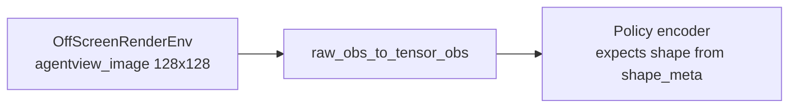
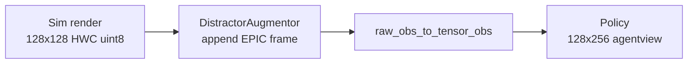

# Eval-Time Video Distractor Augmentation for LIBERO

Plan for augmenting the LIBERO **evaluation environment** so policies trained on distracted datasets receive the same `128×256` agentview layout they saw during training: robot sim render on the left, moving EPIC-Kitchens clip on the right.

Related: offline dataset augmentation is documented in `/datastor2/mrudolph/LIBERO/datasets_distract/AUGMENTATION.md` and implemented in [`scripts/augment_libero_distractors.py`](scripts/augment_libero_distractors.py).

---

## Problem

Training datasets in `/datastor2/mrudolph/LIBERO/datasets_distract` widen `agentview_rgb` from `(128,128,3)` to `(128,256,3)` by appending a resized EPIC-Kitchens frame on the right. The simulator still renders a plain `128×128` image.

Today, eval rollouts feed the policy the unmodified sim observation:



For distracted-trained checkpoints, the encoder was built for `(3,128,256)` agentview. `inference_evaluate` in [`libero_exp/algos/base.py`](libero_exp/algos/base.py) loads `shape_meta` from HDF5, and [`libero_exp/models/bc_transformer_policy.py`](libero_exp/models/bc_transformer_policy.py) uses that shape directly. Eval must reconstruct the same layout at runtime:



---

## Design principles

1. **Match training exactly** — same source video (`p01_01`), resize (`456×256 → 128×128`, `INTER_AREA`, BGR→RGB), layout (`hconcat_right`), and 1-frame-per-timestep advancement.
2. **Augment after render, before tensor conversion** — do not change MuJoCo camera resolution in [`libero_exp/utils/env_utils.py`](libero_exp/utils/env_utils.py); keep `camera_heights/widths = cfg.data.img_size` (128).
3. **Only touch agentview** — leave `robot0_eye_in_hand_image` / `eye_in_hand_rgb` unchanged.
4. **Single code path** — both mid-training rollouts and [`eval_libero.py`](eval_libero.py) go through [`rollout()`](libero_exp/utils/results_utils.py).

---

## Step 1: Extract shared distractor logic

Refactor the core from [`scripts/augment_libero_distractors.py`](scripts/augment_libero_distractors.py) into a reusable module.

**New file:** `libero_exp/utils/distractor_utils.py`

- `DistractorSource(frames_dir)` — sorted JPG list, `num_frames`, lazy `load_frame(index) -> (128,128,3) uint8 RGB`
- `append_distractor(robot_hwc, distractor_hwc) -> (128,256,3) uint8` — horizontal concat
- `DistractorAugmentor` — holds per-episode state for vector envs:
  - `reset(env_num, rng_seed)` — sample start index `s` per env (uniform over valid starts, same as training)
  - `step()` — advance frame counter per env
  - `apply_to_obs(obs, obs_key="agentview_image")` — for each env `k`, concat sim frame with `load_frame(s_k + t_k)`

Keep constants identical to the dataset script: `TARGET_H=TARGET_W=128`, `LAYOUT="hconcat_right"`.

---

## Step 2: Add Hydra config

**Extend** [`libero_exp/configs/base/data/default.yaml`](libero_exp/configs/base/data/default.yaml):

```yaml
distractor:
  enable: false
  frames_dir: "/u/mrudolph/documents/BC-IB/epickitchens/P01/rgb_frames/p01_01"
  global_seed: 0
  layout: hconcat_right
  temporal: one_frame_per_step
  sample_start: random_per_episode
```

When `distractor.enable=true`:

- Set `data.root_dir` to `/datastor2/mrudolph/LIBERO/datasets_distract` so `shape_meta` reports `(3,128,256)` for `agentview_rgb`.
- Keep `data.img_size: 128` (sim render size only).

Add an eval override yaml (e.g. `libero_exp/configs/bc_policy/vilt_eval_distract.yaml`) that sets `data.distractor.enable=true` and `data.root_dir=.../datasets_distract`.

---

## Step 3: Wire augmentation into rollout

**Modify** [`libero_exp/utils/results_utils.py`](libero_exp/utils/results_utils.py):

At the start of each episode (inside `for num_env_rollout in range(...)`, after `env.reset()` / `set_init_state`):

```python
if cfg.data.distractor.enable:
    augmentor = DistractorAugmentor(cfg.data.distractor.frames_dir)
    augmentor.reset(env_num=cfg.env.env_num, seed=derive_seed(cfg, env_idx, task_idx, num_env_rollout))
```

Inside the step loop, **before** `raw_obs_to_tensor_obs(obs, ...)`:

```python
if cfg.data.distractor.enable:
    obs = augmentor.apply_to_obs(obs, obs_key="agentview_image")
```

`apply_to_obs` should read `obs[k]["agentview_image"]` as `(H,W,3)` uint8, append the distractor tile on the right to get `(128,256,3)`, and write back in-place.

**Seed derivation** (reproducible, analogous to training manifests):

`sha256(global_seed | suite | task_idx | rollout_idx | env_slot)` per parallel env slot.

---

## Step 4: Fix shape_meta loading for inference

**Modify** `inference_evaluate` in [`libero_exp/algos/base.py`](libero_exp/algos/base.py) (~line 550):

When `distractor.enable=true`, ensure `root_dir` points at `datasets_distract` and optionally assert:

```python
assert shape_meta["all_shapes"]["agentview_rgb"] == (3, 128, 256)
```

No change needed to `build_env` camera sizes.

---

## Step 5: Update saved rollout videos (optional but recommended)

[`results_utils.py`](libero_exp/utils/results_utils.py) (lines 74–84) and [`video_utils.py`](libero_exp/utils/video_utils.py) currently log the raw `128×128` sim frame.

**Recommended:** log the **post-augmentation** `128×256` frame so saved MP4s match what the policy sees. Document this in `AUGMENTATION.md`.

---

## Step 6: Validation plan

1. **Unit test** — `append_distractor` output shape `(128,256,3)`; left half byte-identical to input; frame index advances 1 per step.
2. **Visual sanity check** — compare one eval rollout frame to a training HDF5 frame (robot left, kitchen right).
3. **Shape check** — load distracted checkpoint with `distractor.enable=true`, run 1 rollout step, confirm no encoder shape errors.
4. **A/B eval matrix:**

| Policy trained on | Eval distractor | Expected |
|---|---|---|
| `datasets/` (clean) | off | baseline success rate |
| `datasets/` (clean) | on | likely degraded (distribution shift) |
| `datasets_distract/` | on | target metric |
| `datasets_distract/` | off | likely degraded (missing right half) |

5. **Slurm eval** — reuse [`eval_libero.py`](eval_libero.py) with new config overrides. Distractor frames live under `/u/mrudolph/documents/BC-IB/epickitchens/...` (accessible on compute nodes; same `/datastor2` staging caveat as dataset augmentation).

---

## Files to touch

| File | Change |
|---|---|
| `libero_exp/utils/distractor_utils.py` | **New** — shared augmentor |
| `scripts/augment_libero_distractors.py` | Import from `distractor_utils` (DRY) |
| `libero_exp/configs/base/data/default.yaml` | Add `distractor:` block |
| `libero_exp/configs/bc_policy/*_eval_distract.yaml` | **New** eval config preset |
| `libero_exp/utils/results_utils.py` | Instantiate augmentor per episode; apply before policy |
| `libero_exp/algos/base.py` | Optional shape assertion when distractor enabled |
| `datasets_distract/AUGMENTATION.md` | Add "Eval-time augmentation" section |

---

## Usage after implementation

```bash
python eval_libero.py \
  --config-name=vilt_eval_distract \
  eval.load_path=/path/to/run \
  data.root_dir=/datastor2/mrudolph/LIBERO/datasets_distract \
  data.distractor.enable=true
```

For mid-training rollouts, set the same `data.distractor.*` keys when `eval.enable_rollout=true`.

---

## Out of scope (future)

- Multiple distractor videos / per-task video selection
- Matching eval distractor windows to training manifest `start_frame` per demo
- Overlay/blend instead of side-by-side concat
- Automatic `/datastor2` staging wrapper for eval on nodes without that mount
